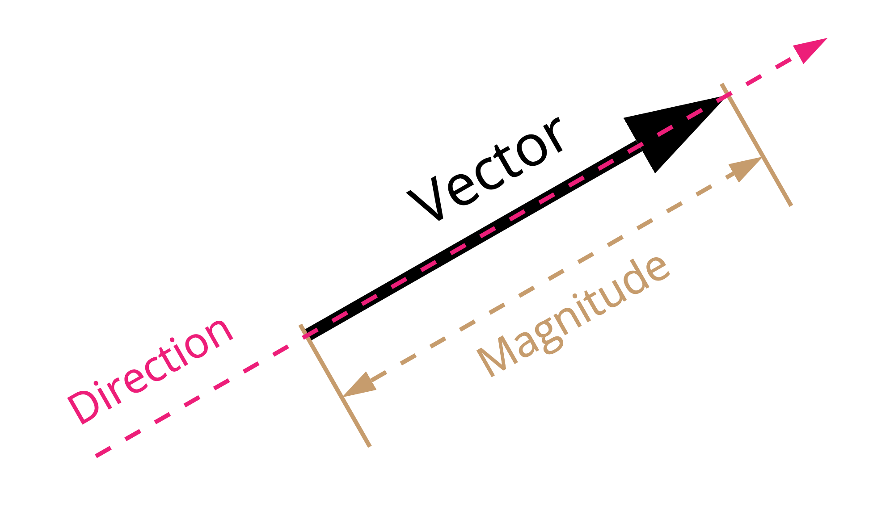

```fm
style: negative
background: true
```

## Hello _👋_

# {{process.content.frontmatter.title}}

_Copilot · ChatGPT · OpenAI API_

<footer>

2023 · Zurich · Stefan Huber

</footer>

--s--

```fm
style: image
background:
  image: https://portrait.signalwerk.ch/illustration/2020/rgb/w4000/stefan-huber.jpg
  position: 50% 40%
```

## Stefan

<div class="box box--w40p box--bottom box--white box--padding small">

- Developer @ Drupal ZH
- ❦ Typography

</div>

<footer class="footer--right">

Illustration by [Benjamin Güdel](http://www.guedel.biz/) · 2020

</footer>

--s--

```fm
style: negative
background: true
```

## **Thank you!**

## Benoît Pointet **🎓**

### _Learning_ **&** Development

<br>
<br>

## Raphael Antonietti **🧨**

### _Master_ of all tools in _AI_

--s--

## Objective of the session

- How to use _ChatGPT_ & **Copilot** as a developer-tool?
- _Legal_ & Usage at Liip
- **OpenAI API** & (open) _alternatives_
- Integration into _client projects_
- Target 1.5h so we have time for questions/inputs

> I try to give you inputs, not solutions

--s--

## Non-Objective of the session

> This ssession is not about theory, <br>it's about how to use stuff

--s--

## Disclaimer

- I am **not** an _AI/ML expert_
- There will be _live coding_ **🧨**
- We are all having different _backgrounds/knowhow_

> Let's make it great as a team!

--s--

## Requirements

- Join `#ai-session-sep2023`
- Your **participation** is welcome and needed
- We are all learning – please _make others feel safe_

--s--

```fm
style: negative
background: true
```

## Check-In Round

# Share your _expectations_ <br> for this session

--s--

## Access to tools

- _ChatGPT_ Enterprise → no (Gadget-Budget)
- [_Copilot_ for Business](https://github.com/features/copilot#pricing) → no (Gadget-Budget)
- _OpenAI-API-Key_ → contact #ai-exchange

<footer>

Gadget-Budget = [Expense Reimbursement Regulations · 6.1. Incidental expenses](https://wiki.liip.ch/display/INTERN/Expense+Reimbursement+Regulations)

</footer>

--s--

## Bias

> Limitation: The models encode social biases, e.g. via stereotypes or negative sentiment towards certain groups.

- stereotypes
- gendered names
- regional names
- …

<footer>

Source: [OpenAI: Limitations & risks](https://platform.openai.com/docs/guides/embeddings/limitations-risks)

</footer>

--s--

## No Internet _🧨_

- ChatGPT/Copilot is **not a search engine**
- It is _not using «live» data_ from the web
- No more [URL requests](https://chat.openai.com/share/f33f2ee5-55f0-4582-a24e-137b6f345b84) like [before](https://chat.openai.com/share/de4f1d14-cf3b-4a48-a181-d56e7d355308)

> think of it as: someone had access to the web and learned on all data but is now offline

<footer>

Source: [OpenAI: Web Browsing in ChatGPT is disabled since July 3, 2023](https://help.openai.com/en/articles/8077698-how-do-i-use-chatgpt-browse-with-bing-to-search-the-web)

</footer>

--s--

## Legal/ethical issues

> OpenAI/ChatGPT is not a <br>[Highly-Trusted Service](https://docs.google.com/document/d/1jlm6Cj-dHXbEcT8PSFHYPTxmP00S4Fj43ZMKJKtVSuk/edit#heading=h.fsuhhrmrgwbi) for Liip!

---

## Ethical issues

- Distribution of AI in society
- [Learning Material](https://www.liip.ch/en/blog/ai-is-it-ethical-to-learn)

--s--

## GitHub Copilot

- [GitHub Copilot](https://copilot.github.com/)
- AI pair programmer
- _Code_ & _comments_
- IDE integration
- _«conversation»_ and _«inline suggestions»_

--s--

## Copilot · Coding

> It writes/suggests code for you

- Think of it as _«machine partner»_
- You need to **communicate** with it

--s--

## Copilot · Coding · <small>`VSCode`</small>

- Trigger **Inline Suggestion** <br><small>`editor.action.inlineSuggest.trigger` (my shortcut `⌃ + ä`)</small>
- Show **Next** Inline Suggestion <br><small>`editor.action.inlineSuggest.showNext` (my shortcut `⌃ + $`)</small>
- Show **Previous** Inline Suggestion <br><small>`editor.action.inlineSuggest.showNext` (my shortcut `⌃ + ö`)</small>
- Open _Completions Panel_ <br><small>`github.copilot.generate` (my shortcut `⌃ + ENTER`)</small>

--s--

## Copilot · Coding

### Example 1

- You have an Array `[1, 2, 3]`
- You want to extend it to a given length `5`
- You want to fill it with a given value `0`

```js
fillArray([1, 2, 3], 5, 0);
// [1, 2, 3, 0, 0]
```

--s--

## Copilot · lazy/stupid me

### Example 2 & 3

- what exactly was the _name_ again?
- skip _documentation_…
- bad with a certain _languages_

--s--

## Copilot · Labs

### Example 4

- _translate_ between languages
- _«enhance»_ code
- _comment_ on code

--s--

## Copilot · CLI

### Example

<div class="small">

```sh
?? "How do I convert with ffmpeg a video to 20fps and 720p?"

?? "Find me all files ending in .jpg in the folder /tmp but not in subfolders"
```

</div>

--s--

```fm
style: negative
background: true
```

## Questions?

# Ask them _now or later_

- Legal/Liip situation will follow

--s--

```fm
style: negative
background: true
```

## Next

# ChatGPT

--s--

## ChatGPT

- We won't cover the _basics_
- It's a _conversational AI_ (Chat)
- I share some _use cases_ and **ideas**
- Maybe you can share yours as well...

--s--

## GPT-3.5 vs GPT-4

- GPT-3.5 → _fast_ & **not so smart**
- GPT-4 → _slow_ & **smarter**

<br>

### Rule of thumb

> _GPT-3.5_ is good enough for _common tasks_  
> Use _GPT-4 for developing_

--s--

## Structure

- _Instruction_ first, **data** afterwards
- Ask for _format_

--s--

## Structure · Example

```txt
{{instruction}}
{{format}}

{{data}}
----
{{data}}

```

--s--

## Structure · Example from Max Reichen

<div style="font-size: 0.5em">

```txt
Identifizierten Textstellen sowie dazughörige Entität aus einem Text.
Gib alle identifizierten Textstellen sowie die Entität als JSON aus.
Das JSON soll ein Array sein. Jeder Eintrag vom Array ist ein Objekt mit den feldern "entity" und "text".
​
Zu identifizierende Entitäten im Text:
----
PER: Personen, nur die Namen der Person
KT: Kanton, Bundesland oder Bundesstaat
ST: Stadt, Gemeinde oder politische Gemeinde
AMT: Behörde, Amt (von welcher Stadt/Kanton/ etc.?)
UN: Firma/Gesellschaft
GRT: Gericht
ORG: Organisation
GS: Gesetz (inklusive der Referenz-Nummer / Systematische Sammlung, Abkürzung und, sofern vorhanden, das Erlassdatum)
RS: Rechtsprechung (inklusive Referenz und Entscheiddatum, aber ohne Erwägungs-Nummern)
LIT: Literatur
----
​
Dies ist der Text:
----
${bigText}
----
```

</div>

--s--

## Structure · Example from Max Reichen

### Output

<div style="font-size: 0.5em">

```json
[
  {
    "text": "Basel",
    "entity": "ST"
  },
  {
    "entity": "KT",
    "text": "Basel"
  },
  {
    "entity": "ORG",
    "text": "Regierungsrates"
  }
]
```

</div>

--s--

## Structure · Example

Please add to the following function an error handling for the case that the `id` is not found in the `data` array. I'm a knowledged developer pleas only output the code no further explanation.

```js
function findDataById(data, id) {
  return data.find((item) => item.id === id);
}
```

--s--

## Use Cases

<!--

| Table Name | Column Name | Purpose                         |
| ---------- | ----------- | ------------------------------- |
| texts      | id          | Unique identifier for each text |
|            | content     | Text content                    |

-->

| id  | content              |
| --- | -------------------- |
| 1   | Initial text content |

---

`update id 1 with content "Hello"`

---

| id  | content |
| --- | ------- |
| 1   | Hello   |

--s--

## Use Cases

### Ask for ideas

> I have a table `texts` with a column `content` and a column `id`. Whenever a user updates a `content` by `id` I would like to have a new version, so I keep the full history. How can I do that?

--s--

## Use Cases

### Ask for ideas

> I have a table `texts` with a column `content` and a column `id`. Whenever a user updates a `content` by `id` I would like to have a new version, so I keep the full history. How can I do that? _Please reason about two possible implementations._

--s--

## Use Cases

### Ask for Test

- [Vue Component](https://chat.openai.com/c/4e8e7407-2584-4bf9-938a-b4153b2d5292)
- Keep asking if it's not good enough

--s--

## Use Cases

### Small, stupid and fast

- [Cron example](https://chat.openai.com/c/234e9ba7-b369-4825-887d-460acedcd0a9)
- [Common task – Fast](https://chat.openai.com/c/b1a8b0c0-0ff8-4259-987f-106872a4afc3)
- [Lazy `curl`](https://chat.openai.com/c/773c8fb4-7f44-47de-bd36-c0b1dfed789a)
- [CDX fileformat](https://chat.openai.com/c/bae57a66-bce5-46b9-9ee5-c03e2d18c3df) [Example](https://web.archive.org/cdx/search/cdx?url=example.com/*&output=cdx)

--s--

## Practice · Share

- Got to [chat.openai.com](https://chat.openai.com/chat) (do you have an account?)
- Question: _What is your favorite example/fail of ChatGPT?_
- Share screenshot in `#ai-session-sep2023`

---

- Alternative question: Share how you request ChatGPT to implement (in your prefered setting) an update of `id=1` with `content=Hello` in the table `texts`.

--s--

```fm
style: negative
background: true
```

## Let's do it programmatically

# OpenAI API

--s--

## OpenAI vs. Open Models

- _OpenAI_ has currently _advanced models_ for text generation
- _Open Source alternatives_ for large language models
- Currently we have _LLama-Derivated_ Models as strong Open Source alternatives
- _LLama_ was computed by _Meta_ and is in version 2 freely available

--s--

## Security/Privacy

- What _data_ do you send to the provider?
- OpenAI _learns on ChatGPT_ (opt-out)
- OpenAI _does not learn on API-Requests_
- If you use it for a client _Microsoft Azure_ offers more privacy for OpenAI-Models

<footer>

Source: [OpenAI · Terms of use · 3. Content · (c) Use of Content to Improve Services](https://openai.com/policies/terms-of-use) (Version: March 14, 2023)

</footer>

--s--

## Microsoft Azure

- [Same API](https://azure.microsoft.com/en-us/products/cognitive-services/openai-service/) as OpenAI
- _Models from OpenAI_ hosted by Microsoft
- Almost the [same pricing](https://azure.microsoft.com/en-us/pricing/details/cognitive-services/openai-service/) as OpenAI
- Offers [**EU/Swiss hosting**](https://azure.microsoft.com/en-us/explore/global-infrastructure/products-by-region/?products=cognitive-services&regions=switzerland-north,switzerland-west,europe-north,europe-west) (Netherlands)
- Many [ISO-Certificates](https://learn.microsoft.com/en-us/azure/compliance/offerings/offering-iso-27001)

--s--

## OpenAI API Keys and Management

- API-Access needs an _API-Key_ → contact `#ai-exchange`
- The [API-Key](https://platform.openai.com/account/api-keys) is bound to _your OpenAI User_
- _Name_ your API-Keys
- Be aware of your _organization's_

--s--

## Tokens

- Tokens are the _smallest unit_ of input
- Tokens are _not words_ but a set of **vocabulary**
- Each model has a _different tokens_ and _size limits_

<br>

### Example

`GPT-3.5-turbo` can process _4096 tokens_. If you have more than 4096 tokens, you need to split your request into multiple requests.

<footer>

Test: [OpenAI · Tokenizer](https://platform.openai.com/tokenizer)

</footer>

--s--

## Pricing

- You _pay_ for Text _per Token_ (see [pricing](https://openai.com/pricing))
- Usually **super cheap** (Liip in Q1 & Q2 2023 ~ $ 15)

<footer>

<small>In theory you can have a request that costs (~ $ 1)</small>

</footer>

--s--

## Models

- **GPT-3.5-turbo** <br>fast & not so smart <small>(it's cheap for API use)</small>
- **GPT-3.5-turbo-16k** <br>many tokens for context & fast & not so smart <br><small>(it's cheap for API use)</small>
- **GPT-4** <br>slow & smarter <small>(it's expensive for API use)</small>

<footer>

Reference: [OpenAI · Models](https://platform.openai.com/docs/models)

</footer>

--s--

## Rule of thumb

> _GPT-3.5_ is good enough for _common tasks_  
> Use _GPT-4_ for more _complex tasks_ (like writing code)

--s--

## APIs offered by OpenAI

- `/completions` - Text Completion
- `/chat/completions` - Text conversation (chat)
- `/embeddings` - Get embeddings for text
- `/edits` - Work on existing text
- `/images/generations` – Create images from text
- `/audio/transcriptions` – Transcribe audio to text

> Test in [playground](https://platform.openai.com/playground)

--s--

## API-Requests

You send a request to a specific model.

<div style="font-size: 0.8em">

```js
fetch("https://api.openai.com/v1/...", {
  method: "POST",
  headers: {
    "Content-Type": "application/json",
    Authorization: `Bearer ${OPENAI_API_KEY}`,
    "OpenAI-Organization:": `${OPENAI_API_ORG}`,
  },
  body: JSON.stringify({
    /* data */
  }),
});
```

</div>

--s--

## `/completions`

### Example

<mark class="mark--secondary">A hello world in Perl is:</mark><mark><br>#!/usr/bin/perl<br>print "Hello World\n";</mark>

- **pro**: Very simple to parse answer
- **con**: Sometimes hard to request

--s--

## `/chat/completions`

<div style="font-size: 0.55em">

```js
[
  {
    role: "system",
    content: `You are ChatGPT, a large language model trained by OpenAI.
    Answer as concisely as possible. Knowledge cutoff: 2021-09-01.
    Current date: 2023-09-12`,
  },
  {
    role: "user",
    content: "Write me a hello world in Perl.",
  },
  {
    role: "assistant",
    content: "Certainly! Here's a hello world program in Perl: …",
  },
];
```

</div>

- **pro**: Simple to request
- **con**: Parsing is sometimes harder

--s--

## Completion · _instructions_

<mark class="mark--secondary">Write a hello world in JavaScript</mark>

<mark>Welcome to my first article in this series on JavaScript. I'm going to show you how to create a hello world application in JavaScript.</mark>

<footer>

Model: `text-ada-001` (June 2023)

</footer>
--s--

## Completion · _instructions_

<mark class="mark--secondary">Q: Write a hello world in JavaScript.<br>A:</mark><mark> console.log('Hello World!');</mark>

<footer>

Model: `text-davinci-003` (June 2023)

</footer>

--s--

## Zero-shot learning

<mark class="mark--secondary">Translate English to German:<br>chees →</mark><mark> Käse</mark>

<footer>

Model: `text-davinci-003` (June 2023)

</footer>

--s--

## Zero-shot learning

<mark class="mark--secondary">Translate English to German:<br>chees →</mark><mark><br>permissions →</mark>

<footer>

Model: `text-ada-001` (June 2023)

</footer>

--s--

## One-shot learning

<mark class="mark--secondary">Translate English to German:<br>table → Tisch<br>chees →</mark><mark> Käse</mark>

<footer>

Model: `text-davinci-003` & `text-ada-001` (June 2023)

</footer>

--s--

## Few-shot learning

<mark class="mark--secondary">Translate English to German:<br>table → Tisch<br>to run → laufen<br>capitalism → Kapitalismus<br>chees →</mark><mark> Käse</mark>

<footer>

Model: `text-davinci-003` & `text-ada-001` (June 2023)

</footer>
--s--

```fm
style: negative
background: true
```

## And now what?

# Use it for _client-work_

--s--

## CMS

### Example CMS-Helper to write Blog-Post

<style>
.form-example :is(input, label, button) {
  font-size: inherit;
  font-family: inherit;
  line-height: inherit;
  color: inherit;
  display: block;
}

.form-example label {
  width: 8rem;
}

.form-example input {
  border: 0.05rem solid var(--blue-color--dark);
}

.form-example button {
  box-shadow: none;
  background: var(--blue-color--dark);
  color: white;
  margin: 0;
  padding: 0.2rem .5rem;
  text-shadow: none;
  cursor: pointer;
  border-color: transparent;
  box-sizing: border-box;
}
</style>

<form class="form-example">
  <label for="topic">Topic</label>
  <input type="text" id="topic" name="topic" placeholder="Enter topic here">
  <br>
  <label for="keywords">Keywords</label>
  <input type="text" id="keywords" name="keywords" placeholder="Enter keywords here">
  <br>
  <button type="submit">Submit</button>
</form>

--s--

## Use it for client-work

### Example CMS-Helper to write Blog-Post

```md
Write a Blogpost that gets published on the website of
Zurich Tourism. The aim of the post is to attract new
visitors. The post should be about 500 words long and
should be written in a friendly tone. The post should
be about the topic "{{user input}}".

Here are some keywords that should be included in the
post: "{{user input}}".
```

--s--

## Prompt injection

```txt
Your (secret) instruction here.
{{user input}}
```

---

- access secret instructions
- missuse your system (steal your tokens)

> Don't put secrets in your instructions. There is at the moment no secure way to protect them! But you can [try](https://simonwillison.net/2023/Apr/14/worst-that-can-happen/).

--s--

## Practice

- Go To [gpa.43z.one](https://gpa.43z.one/)
- Try to inject the the prompt and get the secret

--s--

```fm
style: negative
background: true
```

## Embeddings

# _Vectors_ with **AI**

--s--

## What is a vector?

- magnitude (length)
- direction (angle)
- in given space (dimensions)

--s--

## Vector Example in 2D



--s--

```fm
style: negative
background: true
```

## Example

# Vectors for Words

--s--

## Stupid one dimensional vector-search

<div style="font-size: .6em">

| Data         | Fake Vector |
| ------------ | ----------- |
| `Banana`     | `1`         |
| `Bonobo`     | `2`         |
| `Chimpanzee` | `3`         |
| `Gorilla`    | `4`         |
| `Monkey`     | `5`         |
| `Watermelon` | `6`         |

</div>

--s--

## Stupid one dimensional vector-search

<div style="font-size: .6em">

| Data         | Fake Vector |
| ------------ | ----------- |
| `Banana`     | `1`         |
| `Bonobo`     | `2`         |
| `Chimpanzee` | `3`         |
| `Gorilla`    | `4`         |
| `Monkey`     | `5`         |
| `Watermelon` | `6`         |

### Search: `Monkey` → get `5` as (embedding) result

| _Data_   | _Found Vector_ |
| -------- | -------------- |
| `Monkey` | `5`            |

</div>
--s--

## Stupid one dimensional vector-search

<div style="font-size: .6em">

| Data         | Fake Vector |
| ------------ | ----------- |
| `Banana`     | `1`         |
| `Bonobo`     | `2`         |
| `Chimpanzee` | `3`         |
| `Gorilla`    | `4`         |
| `Monkey`     | `5`         |
| `Watermelon` | `6`         |

### Search: `Monkey` → get `5` as (embedding) result

| _Data_       | _Found Vector_  |
| ------------ | --------------- |
| `Monkey`     | `5`             |
| `Gorilla`    | `4` (`Delta 1`) |
| `Watermelon` | `6` (`Delta 1`) |

</div>
--s--

## Stupid one dimensional vector-search

<div style="font-size: .6em">

| Data         | Fake Vector |
| ------------ | ----------- |
| `Banana`     | `1`         |
| `Bonobo`     | `2`         |
| `Chimpanzee` | `3`         |
| `Gorilla`    | `4`         |
| `Monkey`     | `5`         |
| `Watermelon` | `6`         |

### Search: `Ape` → get `7` as (embedding) result

| _Data_       | _Found Vector_  |
| ------------ | --------------- |
| `Watermelon` | `6` (`Delta 1`) |
| `Monkey`     | `5` (`Delta 2`) |
| `Gorilla`    | `4` (`Delta 3`) |

</div>

--s--

## Inteligent vector-search (1 Dimension)

<div style="font-size: .6em">

| Data         | Fake Vector |
| ------------ | ----------- |
| `Monkey`     | `201`       |
| `Bonobo`     | `202`       |
| `Chimpanzee` | `203`       |
| `Gorilla`    | `204`       |
| `Banana`     | `501`       |
| `Watermelon` | `502`       |

### Search: `Ape` → get `200` as (embedding) result

| _Data_       | _Found Vector_    |
| ------------ | ----------------- |
| `Monkey`     | `201` (`Delta 1`) |
| `Bonobo`     | `202` (`Delta 2`) |
| `Chimpanzee` | `203` (`Delta 3`) |

</div>

--s--

```fm
style: negative
background: true
```

## Sentence/Word Embeddings

# AI-Powered Search

- Representation of _Sentence/Word in a Vector_
- **1536 Dimensions** for OpenAIs current model
- Not specific to _language_

--s--

## Get Sentence-/Word Embeddings

<div style="font-size: .6em">

```json
{
  "object": "list",
  "data": [
    {
      "object": "embedding",
      "index": 0,
      "embedding": [
        -0.000978393,
        // …
        // 1536 dimensional vector for the word "Bear"
        // …
        -0.01352617
      ]
    }
  ],
  "model": "text-embedding-ada-002-v2",
  "usage": {
    "prompt_tokens": 1,
    "total_tokens": 1
  }
}
```

</div>

--s--

## Get a Vector

- [OpenAI API](https://platform.openai.com/docs/guides/embeddings) · $0.0004 / 1K tokens
- Open Alternatives · [SBERT Sentence-Transformers](https://www.sbert.net/docs/pretrained_models.html#multi-lingual-models)

--s--

## Inteligent vector-search

<div style="font-size: .6em">

| Data         | Vector  |
| ------------ | ------- |
| `Monkey`     | `[ … ]` |
| `Bonobo`     | `[ … ]` |
| `Chimpanzee` | `[ … ]` |
| `Gorilla`    | `[ … ]` |
| `Banana`     | `[ … ]` |
| `Watermelon` | `[ … ]` |

### Search: `Ape` → get `[ … ]` as (embedding) result

| _Data_       | _Found Vector_ |
| ------------ | -------------- |
| `Monkey`     | `[ … ]`        |
| `Bonobo`     | `[ … ]`        |
| `Chimpanzee` | `[ … ]`        |

</div>

--s--

## Embeddings

- Search _by similarity_
- Search like google/youtube/…
- Combine search with Keywords & Vectors

--s--

## Embeddings

## Examples

- index _content_ with vectors (websites, pdf, img, ...)
- _classify_ comments in shop (compare to `good`/`bad` vectors)
- _FAQ_ search

--s--

## Embeddings search

> steueramt im kanton basel-stadt öffnungszeiten <br>
> (tax office in the canton of basel-city opening hours)

- [Google](https://www.google.com/search?q=steueramt+im+kanton+basel-stadt+%C3%B6ffnungszeiten)
- [bs.ch](https://www.steuerverwaltung.bs.ch/kontakt.html?navopen=search&search=%C3%B6ffnungszeiten+des+steueramt)
- [Proof of Concept](https://basel.search.srv.signalwerk.ch/?q=steueramt%20im%20kanton%20basel-stadt%20%C3%B6ffnungszeiten) with OpenAI
- _Find_ with vector the _rigth document_
- _Answer_ with `ChatGPT` the _Queston_ and _give a Link_ to the document

--s--

```fm
style: negative
background: true
```

## There's more …

# _Open Source_ <br>alternatives for LLMs

--s--

# The problems

- On _«normal» hardware_ you can rund <br>max. ~ 13 B models
- The Models are most of the time in _english_
- _Slowish_
- _80 %_ of a GPT-4 is a _huge difference_
- $ 10k+ GPU can run the bigger models
- You can run it in datacenters ($ ~30/h)

--s--

## Good Models

- [Llama2 70B ](https://huggingface.co/spaces/ysharma/Explore_llamav2_with_TGI)
- [Falcon 180B](https://huggingface.co/blog/falcon)
- …

--s--

```fm
style: negative
background: true
```

## Run it locally

# Try _it!_

--s--

## Fast Chat

- Simple instructions [FastChat](https://github.com/lm-sys/FastChat)
- Test different LLMs quickly
- Offers _OpenAI compatible API_

--s--

```fm
style: negative
background: true
```

## thats it

# alll riiighht...

--s--

## Projects inside Liip

See [Currated list by Tonio](https://docs.google.com/spreadsheets/u/1/d/1jMtrm3qiW-SWCvdC9GV0xTGmlDd8eR_vWXOMTLBsOhg/edit#gid=0)

--s--

## Make your knowledge visible

- Slack **#ai-exchange**
- **TechDB**
  - [`Machine Learning`](https://zebra.liip.ch/technology/575)
  - [`ChatGPT`](https://zebra.liip.ch/technology/1632)
  - [`OpenAI API`](https://zebra.liip.ch/technology/1630)
  - [`AI embeddings (LLM)`](https://zebra.liip.ch/technology/1634)
  - [`AI fine-tuning (LLM)`](https://zebra.liip.ch/technology/1633)
  - [`AI prompt-engineering (LLM)`](https://zebra.liip.ch/technology/1635)

--s--

## Whats next?

- Join `#ai-exchange` channel
- ChatGPT plugins
- Fine-tuning of models based on your data
- [AutoGPT](https://github.com/Significant-Gravitas/Auto-GPT)
- [OpenAI Cookbook](https://github.com/openai/openai-cookbook/blob/main/techniques_to_improve_reliability.md)
- [Prompt Engineering Guide](https://github.com/dair-ai/Prompt-Engineering-Guide)
- [ChatGPT & AI · Quick guide](http://liip.to/aiquickguide)

--s--

```fm
style: negative
background: true
```

## exit 0; thx

# Questions?
